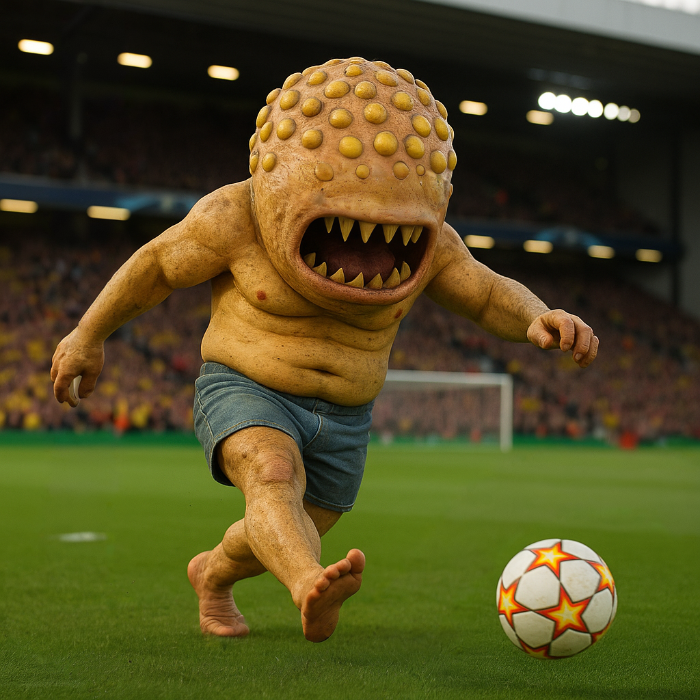

# Argus

<div align="center">
  
</div>

Argus is a computer vision project focused on football (soccer) analytics. It leverages deep learning models to detect players and field features in football videos, enabling advanced analysis and visualization. The project uses YOLO-based models and pose estimation techniques for robust detection and tracking.

## Project Structure

- `argus.ipynb` — Main Jupyter notebook for running detection, pose estimation, and analysis workflows.
- `requirements.txt` — List of required Python packages and dependencies.
- `.gitattributes` — Configuration for Git LFS to handle large model files.
- `players_detection_data.zip` / `field_detection_data.zip` — Datasets for player and field detection.
- `players_detection_model_best.pt`, `field_detection_model_best.pt`, `yolov8x-pose.pt`, `yolo11n.pt` — Pretrained model weights (some tracked with Git LFS due to size).
- `test.mp4`, `test_result_1.mp4` — Example input and output videos.
- `players_detection_runs/` — Contains results and logs from player detection runs.
- `field_detection_runs/` — Contains results and logs from field detection runs.

## Requirements

- Python 3.11.12
- ultralytics
- supervision
- jupyterlab
- pytorch
- torchvision
- ipywidgets
- transformers
- sentencepiece
- protobuf
- pip
- sports

> **Note:** Some model files are managed with [Git LFS](https://git-lfs.github.com/). Make sure you have Git LFS installed to download them.

## Getting Started

1. **Clone the repository:**
   ```sh
   git clone https://github.com/yourusername/argus.git
   cd argus
   ```
2. **Install Git LFS and pull large files:**
   ```sh
   git lfs install
   git lfs pull
   ```
3. **Install Python dependencies:**
   ```sh
   pip install -r requirements.txt
   ```
4. **Launch JupyterLab and open the notebook:**
   ```sh
   jupyter lab
   ```
   Open `argus.ipynb` and follow the instructions in the notebook to run detection and analysis.

## Discussion


With sufficient data to train robust models and adequate computing power, detecting the ball and player positions in football games enables the extraction of virtually any type of statistic. This includes player heatmaps, pass maps, possession statistics, tactical analysis, and more. Such insights can be leveraged for coaching, broadcasting, fan engagement, and advanced analytics in both professional and amateur football.

---

## Thank You 

Thank you for exploring Argus with me! I hope you find this repository helpful and inspiring as you dive into the world of computer vision and sports analytics. Feel free to fork the repo and make contributions. I will review them as soon as possible and your contributions will be merged into the main repository.
